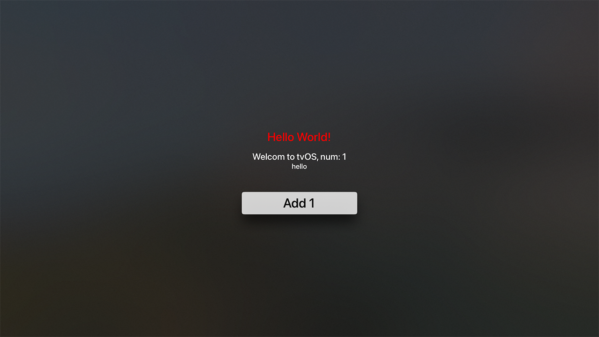
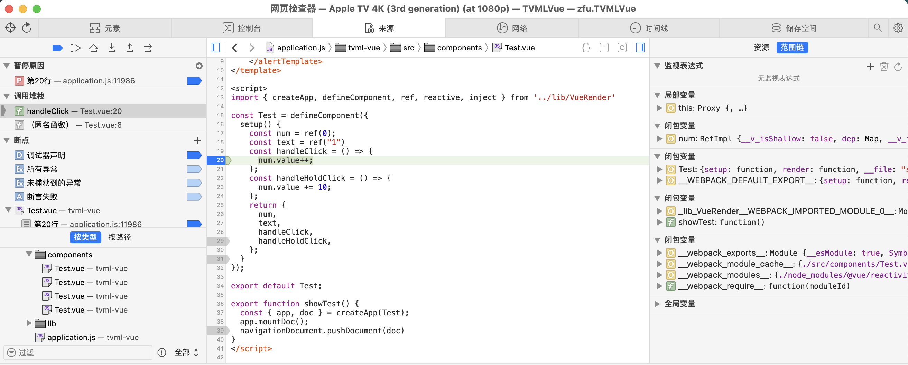

A Simple Vue render for TVML

```shell
cd tvml
npm install
npx webpack serve

Open app/TVMLVue/TVMLVue.xcodeproj and run on tvOS simulator
```

What works:

+ supports SFC and defineComponents
+ supports <style>
+ supports TVML events

What not works:
seperate CSS file not work

screenshots:




